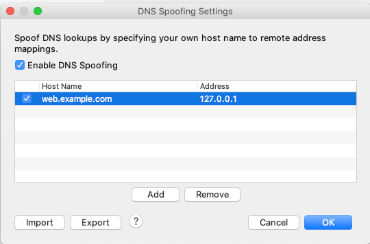
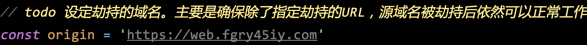
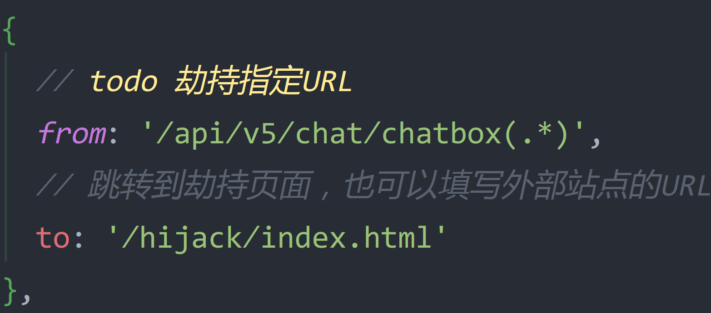

# DNS劫持验证

## 运行环境准备
- node
- npm
- http请求调试工具[charles](https://www.charlesproxy.com/download/latest-release/)
- 443端口没有被占用

For windows:
如果你的windows电脑没有node环境，你可以使用[PowerShell安装脚本](./env-installer.ps1)

For mac:
```bash
brew install nvm
nvm install --lts
```

## 在charles工具中添加 DNS Spoofing 记录
设置步骤可以参考[charles DNS欺骗](https://www.axihe.com/tools/charles/tools/dns-spoofing.html)

将需要劫持的域名添加到记录中，并设定好ip，ip可以使用127.0.0.1。


## 拦截指定的URL
找到[lws.config.js](./lws.config.js)配置
- 设定被拦截的域名，确保原域名被劫持后，依然可以正常访问

- 劫持特定的URL。通常劫持案例只会拦截特定URL，来满足其商业目的。


## 启动中间人代理服务器
```bash
npm i
npm run start
```

## 修改终端设备的代理设置
这一步需要将网络代理的ip地址和端口，设置charles为你提供代理服务所属电脑的IP和端口（默认8888），关于如何设置手机或电脑的网络代理，可以谷歌/百度找答案。

最后记得在测试访问劫持URL前清理缓存，如果你之前已经访问过的话。

__补充说明：__

真实场景中，一般是用户网络的上层路由自动分配了有问题的DNS Server IP地址，这个DNS Server可能因某种商业目的，恶意修改域名指向的IP。
这里为了模拟DNS劫持效果，选择开发者常用的请求调试工具charles，并使用其DNS spoofing，来模拟这种场景

# 再聊聊被劫持的那点儿事

## 先看看用户一般是怎么中招的

__先说纯浏览器环境__

1. 用户打开了浏览器，输入了https网址
2. 浏览器出现安全提示，表示ssl证书有问题
3. 用户安全意识不高，不懂啥意思，于是点击继续访问
4. 然后加载了恶意网址

__再说混合APP的Webview环境__

1. 用户点击了某个主菜单，比如活动
2. APP不检查SSL证书是否有问题，然后无提示加载了恶意网址

## 有应对办法吗？

对SSL证书异常的情况，只有APP有机会展示友好的UI，因为至少APP还可以控制住Webview。如果APP做了SSL证书检查，配上友好错误UI，引导用户设置DNS，是相对完美的办法。

而web h5客户端，则基本没机会，因为依赖于浏览器运行环境（不可控），加上用户安全意识不强，上游DNS又出了问题，只能选择引导用户修改DNS。

最终都得引导用户修改DNS，或变更健康的网络环境。
