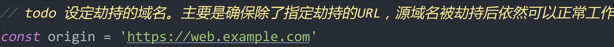

# DNS劫持验证

## 运行环境准备
- node
- npm
- http请求调试工具[charles](https://www.charlesproxy.com/download/latest-release/)
- 443端口没有被占用

For windows:
如果你的windows电脑没有node环境，你可以使用[PowerShell安装脚本](./env-installer.ps1)

For mac:
```bash
brew install nvm
nvm install --lts
```

## 在charles工具中添加 DNS Spoofing 记录
设置步骤可以参考[charles DNS欺骗](https://www.axihe.com/tools/charles/tools/dns-spoofing.html)

将需要劫持的域名添加到记录中，并设定好ip，ip可以使用127.0.0.1。


## 拦截指定的URL
找到[lws.config.js](./lws.config.js)配置
- 设定被拦截的域名，确保原域名被劫持后，依然可以正常访问

- 劫持特定的URL。通常劫持案例只会拦截特定URL，来满足其商业目的。


## 启动中间人代理服务器
```bash
npm i
npm run start
```

## 修改终端设备的代理设置
最后一步需要将网络代理的ip地址和端口，设置charles为你提供代理服务所属电脑的IP和端口（默认8888），关于如何设置手机或电脑的网络代理，可以谷歌/百度找答案。

补充说明：
真实场景中，一般是用户网络的上层路由自动分配了有问题的DNS Server IP地址，这个DNS Server可能因某种商业目的，恶意修改域名指向的IP。
这里为了模拟DNS劫持效果，选择开发者常用的请求调试工具charles，并使用其DNS spoofing，来模拟这种场景
